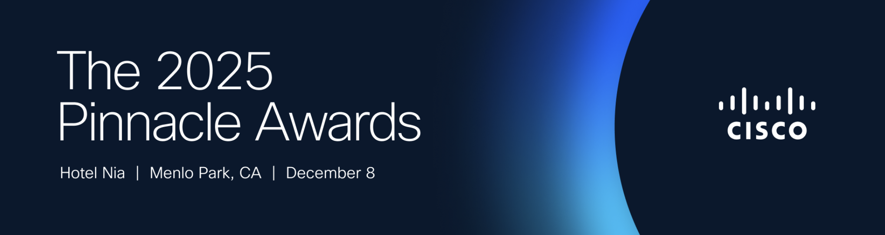

# Executive Overview & General Information about Candidate

**Cisco Distinguished Systems Engineer Nomination — Bruce McDougall**  
*Draft — August 2026. Finance-validated Web/Hyperscale segment bookings (2022–2026) integrated; account-level and SP/Global $ still marked where pending.*

---

## Career Path

| Role / Title | Dates | Notes |
| :--- | :--- | :--- |
| Network Engineer, Expedia | 2004 – 2007 | Large-scale DC networking; early hyperscale-style thinking (MPLS in the DC) |
| Systems Engineer, Consulting Systems Engineer, Cisco (Service Provider) | ~2008 – 2014 | Foundation in SP routing, WAN, and data center |
| Consulting Systems Engineer, Cisco Web / Hyperscale | ~2015 – 2020 | Lead strategic production network routing and data center engagements across Hyperscale/Web accounts |
| Principal Systems Engineer (PSE), Americas ASP + Web | Aug 2020 – Jun 2026 | Web/hyperscale + tier-1 SP; cross-theater enterprise/APJC enablement |
| Principal Systems Engineer (PSE), Global | Jun 2026 – Present | **Lead Cloud-SP architect** on Matt Gillies’ Global Solutions Engineering team |
| Distinguished Systems Engineer (candidate) | 2026 | |

**Education:** BA, University of Washington (1996)

**Certifications:** CCIE Service Provider #35169 (2012)

---

## Candidate Portrait

Bruce McDougall is a technical leader who drives innovation and impact by anticipating where the network industry is headed, often three to five years ahead of mainstream adoption, and then doing the sustained work to bring Cisco, its field teams, and its largest customers there with him. His expertise spans hyperscale and cloud-native networking, AI/ML fabrics, Linux, Kubernetes and open-source software, SONiC, network-as-a-service, and Segment Routing v6 (SRv6). Combined with deep service provider architecture experience, Bruce's dual SP + Web/Hyperscale specialization is unique within the PSE/DSE community and across Cisco’s sales organization.

Bruce is known as an exceptional collaborator and listener with genuine empathy for the challenges Cisco customers face. The operators he works with do not think of themselves as “customers” in a transactional sense, they are highly sophisticated and deeply technical individuals and groups tasked with designing and deploying infrastructures at massive scale and incredible speed. Bruce meets them as a peer technologist who helps solve problems of scale, agility, and architectural coherence, whether the conversation starts in a hyperscaler AI backend, a tier-1 WAN, or a global SP core. His exposure to Hyperscale and cloud has shaped his own architectural thinking in terms of platforms, eliminating silos and complexity, and thinking differently about the relationships between network control, forwarding, and policy, all of which have been highly influential within the PSE/DSE organization and with multiple business units.

For nearly a decade Bruce has worked closely with Clarence Filsfils and the SR engineering organization as a field lead, trusted advisor, and innovation partner; effectively a central participant in the SR/SRv6 brain trust. He has influenced product direction, open-source strategy, and customer co-development across the IMI portfolio including ASR9000, NCS5xxx, Cisco 8000, SONiC, IOS-XR, and Cisco's SD-WAN, security, and cloud-native platforms. In **2025** he received the **Pinnacle Award** as part of the team recognized for SRv6 uSID’s market impact — a team of roughly 40, almost entirely Cisco engineering, of whom he and DSE Craig Hill were the only two from the sales organization.

His thru-line since the early SDN/NFV era (2012) centers around **host-networking**, **SRv6**, and **Linux**: extending routing, switching, and policy to the server and application control point where, due to the mathematics of massive scale, cloud operators already run their overlays. For every device running a traditional network OS, hyperscale environments may run hundreds or thousands of Linux hosts; Bruce has spent more than a decade evangelizing Cisco’s need for a credible technology presence there—a path that culminated in **Isovalent/Cilium** acquisition influence and today’s **MRC+SRv6** industry convergence.

At each stage of his career Bruce has expanded his span of influence from regional technical SME to global architect of horizon-2 and horizon-3 initiatives. He has been described internally as a “2030 guy” — the person teams call when the goal is to demonstrate Cisco’s vision, or to solve a problem in a unique way. In **June 2026** he transferred from Brook Crossman’s **Americas ASP + Web** organization to **Matt Gillies’ Global** team as lead Cloud-SP architect—formal recognition that his impact already operated at global scale.

### Quantified highlights *(Aug 2020 – present)*

| Dimension | Evidence |
| :--- | :--- |
| **Segment revenue (finance)** | **$10.9B** Web/Hyperscale bookings **2022–2026** in Bruce’s theater; **$5.3B** in **2026 YTD** alone |
| **Production wins** | Meta **$17M** BBF first production order (Feb 2026); Bell **500× C8231-G2** first order (May 2026) |
| **Product delivery** | **8122 SRv6-on-SONiC** for AI backend (Jun 2026); MIG **G200/P200** SRv6 paths for Microsoft, Oracle, and CoreWeave |
| **Innovation** | **18 CPOL** submissions; **6 patents issued / 6 pending**; **Pinnacle Award (2025)**; Bold Bet greenlit project (Jalapeno) |
| **Community Leadership** | CLEU ILT **5.0/5.0** (2023); **40+ BU / 20+ SE** SRv6 workshops (2025); **22** Connected Recognition awards given; **official PSE mentor** to Nacho (**promoted Jun 2026**) and **Christopher Luciano (in progress)**; **5 extended-team PSE promotions** (2023–2024) |
| **Global Impact** | Frequently called upon as a SME for Segment Routing/SRv6, SONiC, Cloud/Hyperscale architecture and cloud-native technologies by teams serving customers outside of ASP/Web (Geico, Fiserv, Adobe, NYU, etc.), and even outside of North America (Rakuten, Evroc, NTT East, Telstra) |

---

## Global Impact Summary

Since **August 2020**, Bruce’s customer impact has expanded **beyond his ASP + Web assignment**—not only into APJC and EMEA, but also into **Americas enterprise, financial services, public sector, higher education, and regional operators**.

**Americas enterprise and financial services.** Bruce has served as SONiC and data center architecture SME for **Geico** (~$1.6M Cisco 8000 win), **Fiserv**, **Adobe** (Cilium EGW and load balancer POC complete Oct 2025), **Honeywell** ($2M Segment Routing Cisco 8000 win), **Texas Instruments**, **Disney**, **The Trade Desk**, **Morgan Stanley**, **Visa** (Isovalent intro), and **NYU**—demonstrating repeatable transfer of cloud-native, SONiC, and SRv6 expertise and collaboration outside his home theater segment.

**APJC and EMEA operators.** Bruce consulted on **Rakuten** SRv6-SDWAN underlay design (Jul 2025), **NTT East** via APJC account team (SRv6 and Cilium introductions, 2025), and is currently engaged with EMEA neo-cloud **Evroc** on WAN, frontend DC, SRv6, and host-based overlay architecture (SONiC, Cilium). Field enablement for **MTN Nigeria** and **DU UAE** through APJC SE Sanjay Nanda produced documented topology outcomes (~$85K lab savings; 2,300-node SRv6 POC) `[verify]`. **Province of New Brunswick** (James Munroe): CLEU 2026 meeting → SRv6 migration design and execution within ~two weeks (skipped SR-MPLS plan).

**Regional operator reach.** **NSight** (Green Bay packet-core SP) engaged Bruce on Cilium, containers, and AI-services architecture (2025–2026)—extending host-networking and cloud-native security into operators outside the tier-1 ASP list.

*More details: [03-global-impact.md](./03-global-impact.md)*

---

## Span of Influence Summary

Bruce’s span of influence has grown from traditional **SP and Cloud Architecture SME** to **cross-BU strategic advisor** shaping how Cisco thinks about, builds, and sells networking for the cloud and AI era.

| Level | Earlier (Horizon 1) | Current (Horizon 2/3) |
| :--- | :--- | :--- |
| **Cisco Engineering** | Protocol testing, pilot validation | Strategic advisor to IMI (Cisco 8000), SONiC, SD-WAN, SSE, and security BUs; drives SRv6 uSID as "unified forwarding architecture" across IOS-XR, IOS-XE, NX-OS, and SONiC (and Linux and Kubernetes/Cilium) |
| **Customer architecture** | Regional SRv6 pilots on assigned ASP+Web accounts | Lead architect on hyperscaler/SP co-development; field enablement patterns reused globally |
| **Corporate strategy** | Individual lab prototypes | Single OS working group (with DSE peers); Future Enterprise Segmentation SWAT team; served on PSE sub-committee (3 years); Isovalent acquisition advocacy |

**Signature influence themes:**

1. **Host-based networking** — Coined and evangelized the “host networking air-gap” concept; CIPOL submissions from 2013/2015; first Cisco Live host-based SRv6 lab (2023). Cisco validation: **Isovalent** acquisition (2023). Industry validation: OpenAI/Microsoft/NVIDIA Multipath Reliable Connection (MRC) architecture and Cisco’s subsequent MRC+SRv6 positioning.

2. **SONiC SRv6 and AI backend** — One of Cisco’s foremost SONiC SMEs; drove internal investment case for SONiC development; works closely with Cisco SRv6 engineers on **SONiC uSID** scope (frontend DC, AI backend, multi-tenancy) and early code validation for customer POCs.

3. **Cross-domain SRv6** — SD-WAN and SSE engineering teams now treat SRv6 as a development differentiator, extending Bruce’s SP/hyperscale architecture into enterprise platforms.

4. **SGT in uSID** — Architecture combining 16-bit Security Group Tags with uSID locators for end-to-end identity and micro-segmentation across enterprise and SP domains.

5. **Talent and standards** — PSE sub-committee member; mentor to multiple PSE candidates and STLDP teams; field lead for Cisco Engineering's "SR-Apps" initiative (2020 - 2022) and engagement with university research efforts; **Web/Hyperscale representative for exec BU interlocks** (2025 - present).

*More details: [04-span-of-influence.md](./04-span-of-influence.md)*

---

## Industry Impact Summary

Bruce’s industry impact extends beyond Cisco account boundaries through **open source projects, public speaking, blogs and publications, and standards-adjacent work**.

- **Open source:** Admin/curator of [github.com/segmentrouting](https://github.com/segmentrouting) and [srv6-labs](https://github.com/segmentrouting/srv6-labs) (Dec 2023; ~38K LinkedIn views Jan 2024 `[verify current]`); [cisco-open/jalapeno](https://github.com/cisco-open/jalapeno); [srv6-mrc-emulator](https://github.com/segmentrouting/srv6-mrc-emulator). Extended by engineers at Verizon, Oracle, and others.
- **Conferences & speaking:** Cisco Live ILT/breakouts/panels (**5.0** scores; **Distinguished Speaker** CLEU 2023); MPLS World Congress operator community (2023); **OCP Summit 2026** (planned, multi-tenant AI fabric); SRv6 operator roadshow (Dec 2025); Pour-Man's Networking podcast (May 2022).
- **Publications:** [segment-routing.net SRv6 uSID on SONiC](https://www.segment-routing.net/blogs/srv6-usid-on-sonic/); Cisco SP360 blogs; ipspace.net citation of srv6-labs; May 2023 SRv6-on-SONiC blog.
- **O'Reilly training — *Open Source Labbing*:** 4-hour course co-developed with Russ White; delivered live twice to hundreds of engineers around the world; recordings in the O'Reilly catalog.
- **Industry alignment:** **MRC+SRv6** in OpenAI/Microsoft/NVIDIA/Broadcom/AMD and Oracle Acceleron materials; multi-vendor SONiC uSID narrative; IETF Vancouver 2024 — *“the 2030 guys”* (Ianik Semko).
- **Thought-leadership arc (exec thru-line):** Host-based Segment Routing CIPOL (2015), elephant-flow balancer proposal (2016), Jalapeño & re-thinking SDN (APIs and databases rather than protocols), and srv6-labs—converging with tier-1 AI fabric designs in 2024–2026.

*More details: [05-industry-impact.md](./05-industry-impact.md)*

---

## Business Impact Summary

Bruce has helped build and mentor a **senior team of grade-12 SEs** leading hyperscale production network engagements across data center (frontend and backend), DCI, metro, cloud direct connect, and WAN/backbone architectures. These are multiyear **co-development partnerships**, not transactional sales cycles: Bruce trains teams on architectures and capabilities before they ship on Cisco platforms, giving them confidence to co-develop with customers until the revenue pipeline matures.

### Finance-validated Web/Hyperscale segment bookings *(2022–2026)*

Americas Web/Hyperscale **org-level** bookings (USD). Validates scale of Bruce’s assigned theater; not individual attribution.

| Customer | 2022 | 2023 | 2024 | 2025 | 2026 | Total |
| :--- | ---: | ---: | ---: | ---: | ---: | ---: |
| Microsoft | $603.4M | $713.5M | $225.6M | $861.5M | $1,571.2M | **$3.97B** |
| Meta | $276.6M | $366.6M | $53.7M | $509.7M | $1,908.5M | **$3.11B** |
| Google | $403.9M | $102.6M | $108.2M | $286.9M | $1,049.3M | **$1.95B** |
| Amazon | $127.2M | $69.1M | $195.6M | $296.4M | $717.3M | **$1.41B** |
| Oracle | $4.4M | $45.3M | $230.0M | $145.7M | $20.6M | **$446M** |
| Apple + Web Platforms | $0.8M | $7.5M | $11.3M | $9.2M | $13.5M | **$42M** |
| **Yearly total** | **$1.42B** | **$1.30B** | **$824M** | **$2.11B** | **$5.28B** | **$10.94B** |

**2026 YTD** is **$5.3B**—more than half the five-year total—driven by Meta (**$1.9B**), Microsoft (**$1.6B**), and Google (**$1.0B**). Tier-1 SP bookings (Bell, Verizon, Videotron, etc.) and Global Impact accounts are **not** in this extract.

### Representative account impact *(Bruce’s role — see [06-business-impact.md](./06-business-impact.md))*

| Customer | Signature outcome | Bruce’s role |
| :--- | :--- | :--- |
| **Meta** | **$17M** BBF production booked (Feb 2026); RBB→SRv6/SL-API | SL-API pioneer (from MSFT SWAN); VXR POC labs; 8223 patch enablement |
| **Microsoft** | SRv6 AI backend on **8122 SONiC** (Jun 2026); PhyNet/dRH/Octans; 1.6T WAN | Lead SME; SONiC training; multi-tenant AI architecture; dRH vs VXLAN |
| **Oracle** | SRv6-for-AI production path by end-2025; 1,000-GPU POC | Lead architect; Hoffman–Singleton study; OCP kickoff |
| **CoreWeave** | ~10k–12k switch scope; WAN backbone design | SONiC SME; SRv6-for-AI architect; Containerlab/VXR labs |
| **Bell Canada** | **500× C8231-G2** first order (May 2026) | End-to-end SRv6, Cilium, NaaS architecture (decade+ partnership) |
| **Verizon / T-Mobile / Boost** | SRv6 roadmap; Magenta Cloud; SRv6 L3VPN on AWS | Architecture consulting; Yukon/NaaS framing; Cilium segmentation |

**Strategic business impact beyond segment bookings:**
- Accelerated Cisco **8122 SRv6-on-SONiC** delivery for AI backend (June 2026)—Microsoft and Oracle had competitor deployments first; Bruce’s advocacy closed the internal investment gap
- **Meta BBF** production win beat Arista/Broadcom for P200 backbone insertion; SL-API pattern reused from Microsoft SWAN engagement that Bruce led in 2019 - 2020
- **Comcast** LB consultation (~$5M scope, Feb 2026 `[verify]`)

*Non–ASP+Web customer wins → [03-global-impact.md](./03-global-impact.md).*

*More details: [06-business-impact.md](./06-business-impact.md)*

---

## Innovation Summary

Innovation is a defining strength of Bruce’s candidacy. He combines **influence over BU product and platform strategy**, **multiple patents**, **open-source execution**, and **customer-co-developed architectures** that become differentiating features and capabilities in Cisco products.

| Category | Evidence |
| :--- | :--- |
| **Awards** | **Pinnacle Award (2025)** — SRv6 uSID team |
| **Patents & IP** | 6 issued patents, 6 pending, 18 total CPOL submissions; defensive publications; includes SP underlay for SD-WAN, SmartTOR for AI, SRv6+SGT, synthetic path trace, orbital FIB scheduling |
| **ET&I Bold Bets Program** | Only field-submitted project (Jalapeno) to advance past first evaluation round |
| **Open source** | Jalapeno ([cisco-open/jalapeno](https://github.com/cisco-open/jalapeno)); segmentrouting org; pioneered GitHub-based Cisco Live lab guides (now common practice) |
| **AI / hyperscale** | SRv6 multi-tenant AI fabric; MRC emulator; SONiC SRv6; Hoffman-Singleton fabric study with Oracle; **Scaling the Cloud to a Billion Servers** (2020 internal workshop → Clarence mandate to crack hyperscale SRv6) |
| **Acquisitions & BU influence** | Isovalent/Cilium SRv6 integration (Thomas Graf LoR); Policy Plane concept gaining MIG traction; EN hackathon SD-WAN/SRv6 winner; ISE unified SRv6+SGT policy model (Dec 2025) |

**Representative innovation narrative:** At IETF Vancouver 2024, Dan B. and Bruce were referred to as “the 2030 guys” (Ianik Semko) for visionary work on architectures the industry would need before the market caught up, endpoint service consumption, and unified forwarding—now validated by MRC+SRv6 in tier-1 AI infrastructure.

### Innovation Timeline *(optional graphic for final package)*

This innovation timeline is more what I consider large career-changing insights or intellectual property milestones in my journey

| Year | Insight / Innovation |
| :--- | :--- |
| 2006 | MPLS in the DC (Expedia) — early scale thinking |
| 2013 | SR to the host; first SR/NFV patents |
| 2015 | Host-networking Patent; cloud control-point shift |
| 2017 | SR Elephant flow balancer (precursor to AI fabric load balancing) |
| 2018 - present | Jalapeno open SDN, APIs not protocols, SR/SRv6 empower applications |
| 2019 | SRv6: scale the cloud to a billion servers |
| 2020 | Jalapeno Bold Bets project; Policy Plane; **Billion Servers** workshop → hyperscale SRv6 mandate, SR-Apps collaboration with Clarence and team |
| 2021 | Isovalent acquisition advocacy begins (industry leading eBPF technology, strategic host-networking asset) |
| 2022 | SRv6 beyond last-hop; cloud-native SRv6, cloud-like consumption of network services |
| 2023 | uSID→TEP; SONiC inflection; srv6-labs launch |
| 2024 | SGT+uSID unified programming; SRv6 for AI industry convergence |
| 2025 | **Pinnacle Award (2025)**; SONiC uSID field/engineering partnership; Meta BBF path |
| 2026 | SRv6 MRC emulator; multi-tenant AI fabric; **8122 SRv6-on-SONiC** ship; Global team transfer |

**Innovation arc (summary):** From early scale thinking (MPLS in the DC) through SR/SRv6 patents (e.g., US9503363, US10250494), host-networking and the **host networking air-gap** (2012–2023), and applied SRv6 across SD-WAN, SASE, and ThousandEyes-class platforms, Bruce’s post-2020 work converges on **AI-era fabrics**: **MRC+SRv6** industry alignment, the [srv6-mrc-emulator](https://github.com/segmentrouting/srv6-mrc-emulator), and multi-tenant AI POC repos ([srv6-msft](https://github.com/segmentrouting/srv6-msft), [srv6-oci](https://github.com/segmentrouting/srv6-oci)) used with Microsoft and Oracle engineering.

*More details: [07-innovation.md](./07-innovation.md)*

---

## Personal Development Summary

Bruce invests in capabilities that **directly enable** DSE-level impact—not credentials in isolation.

**Response to PSE committee feedback (post–Aug 2020):** Deliberately expanded beyond ASP+Web/MIG into SD-WAN, SSE, Future Enterprise Segmentation SWAT Team, co-founded the SOSIE (Single OS working group) with fellow PSEs and DSEs from outside of ASP/Web, Isovalent/security engineering, EMEA peers, CX, and OST Zurich university collaboration.

**Builder skills:** Kubernetes, Cilium/eBPF, Containerlab, GitHub/dCloud workflows, and agent-assisted lab development (“vibe-labbing”) so Bruce ships the prototypes and repos SEs and customers run, not slideware alone. This underpins srv6-labs, MRC emulator, Meta VXR labs, and Adobe Cilium POC rescue (Apr 2024).

**Formal development:** CCIE SP #35169 (2012); PDP (Jul 2025): exec communication coaching **complete**; **MRC** depth (supersedes Ultra Ethernet study); Adobe Cilium EGW/LB **complete**; **Ignacio (“Nacho”) Sanchez — official PSE mentor, promoted to PSE (Jun 2026)**; **Christopher Luciano — official PSE mentor (in progress, since Dec 2024)**; SRF enablement **complete**.

**Mentors:** DSE mentor Vaughn Suazo; unofficial mentors **Matt Gillies** (current manager, Global) and David Jansen.

*More details: [09-personal-development.md](./09-personal-development.md)*

---

## SE Community Leadership Summary

Bruce is a **force multiplier** for the SE community through mentorship, reusable enablement assets, and programs that outlive individual engagements.

- **Cisco Live:** SRv6 Instructor Led Lab (ILT) scores including CLEU23 **5.0/5.0** (Distinguished Speaker); CLEU24 **4.88/4.94**; CLEU25 **4.72/4.94**; CLEU26 **4.94/4.94**; CLUS25 panel **5.0/5.0**; CLUS26 panel **5.0**; 2026 “Beyond the Switchport” breakout session (w/ Chris Lapp) **4.68/4.73**
- **Internal enablement:** Led *Stay Ready Friday* training sessions for ASP/Web (“Build Your Own dCloud lab”, delivery of Cisco Live SRv6 lab for internal audience); coordinated and led a day-long **April 2025 SRv6 DC/AI workshop** for Cisco Engineering and Sales (40+ BU, 20+ SE) with speakers from Microsoft and Alibaba; Tech Elevate; Web SONiC training (Apr 2026); SRv6 for Data Center and AI SE workshop (Dec 2025); **SEVT Build Your Own Lab** sessions with Marty Fierbaugh (Jan 2025, Dec 2025), both **5.0**; **Kaliwoda → MPLS-WC Cilium demo** multiplier
- **Labs published to dCloud catalog:** [Cilium SRv6](https://dcloud2-rtp.cisco.com/content/demo/1113062) and [Intro to SONiC](https://dcloud2-sjc.cisco.com/content/demo/357554) (co-developed with Rob Murphy) demos for field self-service
- **Mentoring:** **Official PSE mentor:** **Ignacio (“Nacho”) Sanchez — promoted to PSE (Jun 2026)**; **Christopher Luciano — in progress (since Dec 2024)**. **PSE candidate extended team** (advisor / package reviewer): Rob Murphy & Roberta Maglione (2023); Masiuddin Mohammed, Marina Ferreira & Alessandro Breccia (2024). Also: Dan Stacks (STLDP/Cilium), Satoshi Yamashita (STLDP), Nico Michel, Rodney, Bob, Kartik; **STLDP Cross Domain Network Broker** team coach (2023) — **team won that year’s Innovation Award**
- **Committee / hiring:** PSE review subcommittee voting member (3 years); technical interviewer for Web production-network SE roles
- **Recognition given:** **22** Connected Recognition awards to peers (2021–2026); see [11-appendix.md](./11-appendix.md)
- **Content:** ASP 8K series, SEVT/SP360 blogs, vidcasts (“I want to send them to everyone” — Jenelle Lee, Apr 2026); pioneered GitHub-based CL lab guides (now common for ILTs)

*PSE committee governance detail → [04-span-of-influence.md](./04-span-of-influence.md).*

*More details: [10-se-community-leadership.md](./10-se-community-leadership.md)*

---

## Becoming a Distinguished Systems Engineer *(candidate statement — first person)*

Promoting to Distinguished Systems Engineer would be the formal recognition of work I am already doing: operating at the intersection of company strategy, industry direction, and the hardest customer problems at global scale.

When I prepared my PSE package, I realized the architectures I cared about could alter Cisco’s trajectory — and the networking industry’s. That is still my goal: networks should be a delight to the operators and applications that depend on them, not a snowflake tax on every new workload. The network exists to serve; my job is to make that service scalable, programmable, and easy to consume.

I have pursued that mission through host-networking, SRv6, open NOS, and AI-fabric architectures—often years before the products caught up. DSE would expand the platform from which I teach peers and customers not what is for sale today but where we need to be in three years; it would not change the mission.

As a DSE I would:

- **For Cisco:** Continue bridging IMI, SONiC, cloud-native security (Cilium/eBPF), and SP transport into one coherent story—especially for AI factories and open NOS adoption
- **For the SE community:** Scale the lab-and-github enablement model so grade-12 SEs can co-develop with hyperscalers ahead of feature availability
- **For customers and partners:** Remain a trusted peer architect on horizon-2/3 problems—host networking, SRv6 end-to-end, MRC/multi-tenancy, and cloud-like consumption of network services
- **For the industry:** Keep publishing open artifacts (labs, POCs, whitepapers, and architectures) that accelerate adoption and hold Cisco accountable to the future we claim

I do the hard work when nobody is looking and build credibility over years—because technology operators deserve networks that work as naturally as the applications they run.

---

## Direct Leader Summary

*Bruce reported to **Brook Crossman** (ASP/Web VP, Systems Engineering) for ~5 years through Jun 2026. He transferred to the **Global** team under **Matt Gillies** in Jun 2026. The package may include direct-leader input from **both** Brook and Matt; Brook’s Talent Assessment reflections (1HFY24–1HFY26) are compiled in [02-direct-leader-recommendation.md](./02-direct-leader-recommendation.md). 2HFY26 manager comments pending.*

Brook Crossman describes Bruce as ASP’s **center of gravity for SRv6 and AI-forwarding innovation**—a senior technical leader whose patents, **2025 Pinnacle Award**, and customer-facing labs set a high bar for teamwork and depth. Bruce **represents Cisco exceptionally well** with hyperscalers and SPs inside and outside the segment; engineering forums and peers across EMEA/APJ routinely seek his time. Brook consistently rates Bruce as meeting **Business Outcomes** and **Guiding Principles**, notes his coaching of next-generation PSEs (**official mentor** to **Ignacio Sanchez — promoted Jun 2026**; **Christopher Luciano — current official mentee**; **extended-team** advisor for **five** successful PSE promotions **2023–2024**), and supports DSE promotion with aligned near-term goals: **SONiC SRv6 G200/P200** delivery for Microsoft and Oracle, disaggregated WAN franchises, Isovalent SRv6 GA path, and the comprehensive SRv6-for-AI demonstrator. Development focus: **executive-ready communication** and selective delegation so Bruce can scale impact without over-committing.

**LoR note:** Sponsor letter is typically the same as the direct-leader recommendation, or co-authored by the direct leader and their manager (**John Dorval** for Brook; **Tim Carnes** for Matt).

---

## Sponsorship Summary

Bruce has obtained letters of recommendation from **more than 50% of the global DSE community**, plus BE leadership, sales leadership, and customers/partners. Letters are stored externally; table to be completed in [08-sponsorship.md](./08-sponsorship.md).

---

## Draft Open Items

- [x] Align exec summaries with [AGENTS.md](./AGENTS.md) segment rules (Global = non–ASP+Web)
- [x] Harvest body sections 03–07, 09–10 (June 2026)
- [x] Integrate finance Web/Hyperscale segment bookings (2022–2026)
- [ ] Validate Global Impact $ separately from Business Impact (Geico ~$1.6M cited `[verify]`)
- [ ] Finance: SP segment bookings (Bell, Verizon, Videotron, etc.)
- [ ] John Dorval / MSFT WAN validation for SWAN claims
- [x] Confirm career path dates; document Jun 2026 transfer to Global / Matt Gillies
- [x] Draft Direct Leader Summary from Talent Assessments (Brook + Matt LoR path documented)
- [x] Exec summary voice pass — third person body; single first-person block (Becoming a DSE); Candidate Letter merged into Portrait
- [ ] Brook and/or Matt: final Direct Leader Recommendation + 2HFY26 assessment when available
- [ ] Complete [08-sponsorship.md](./08-sponsorship.md) LoR table
